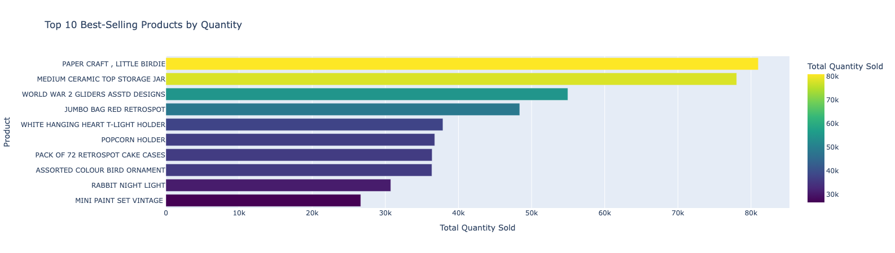
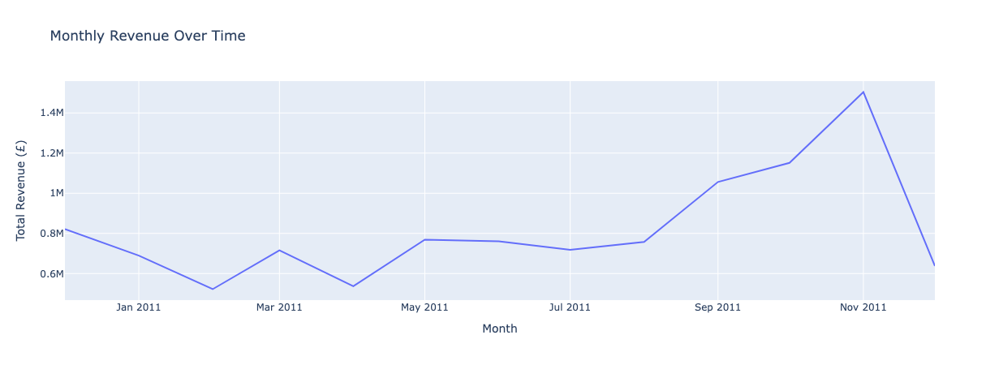
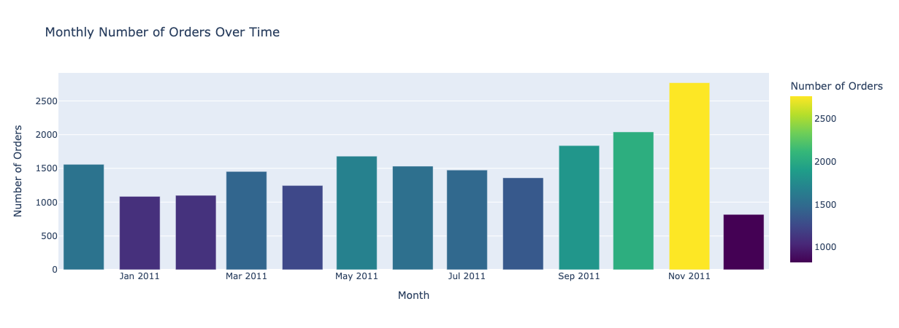
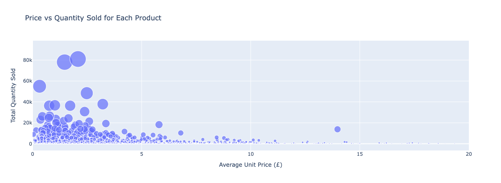
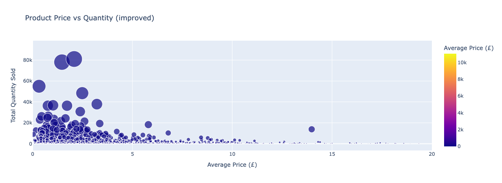
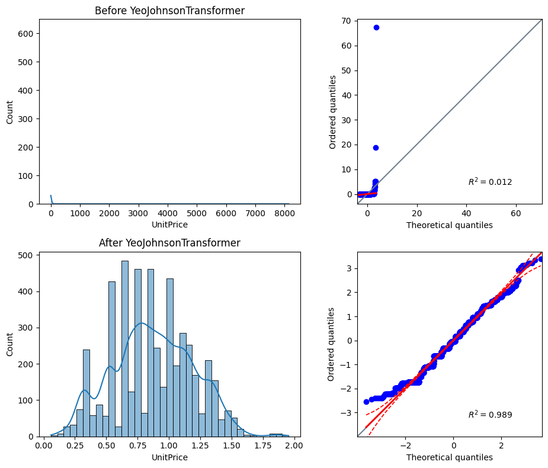
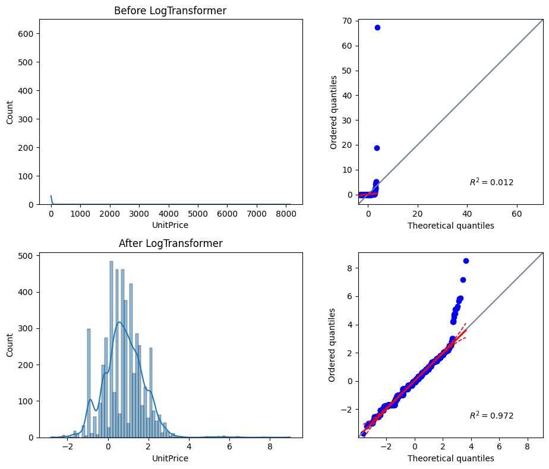
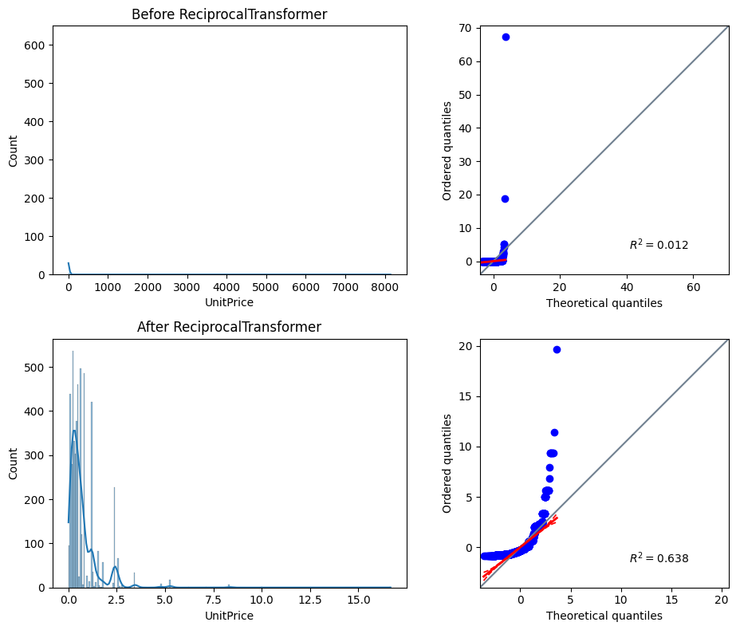
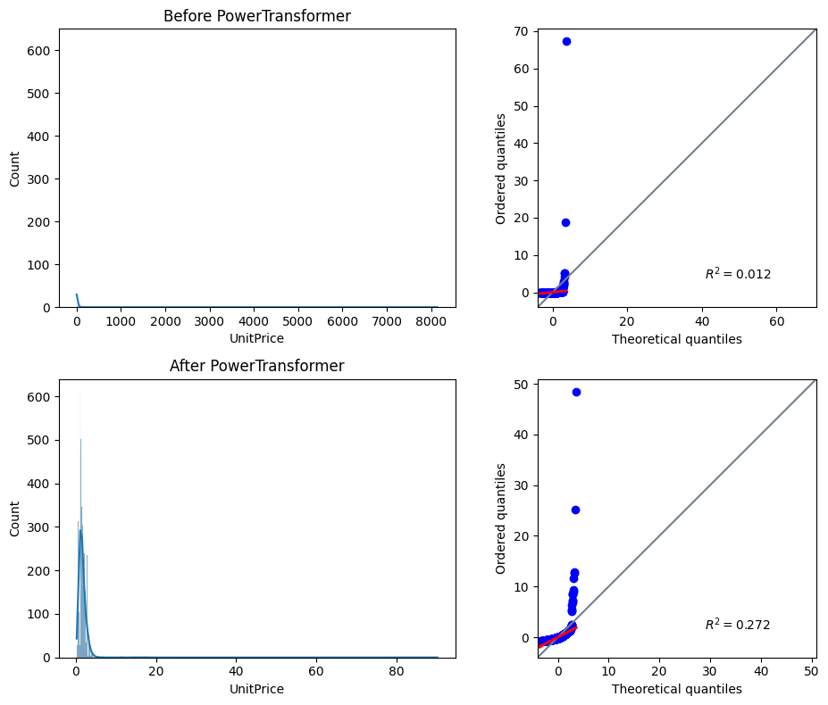
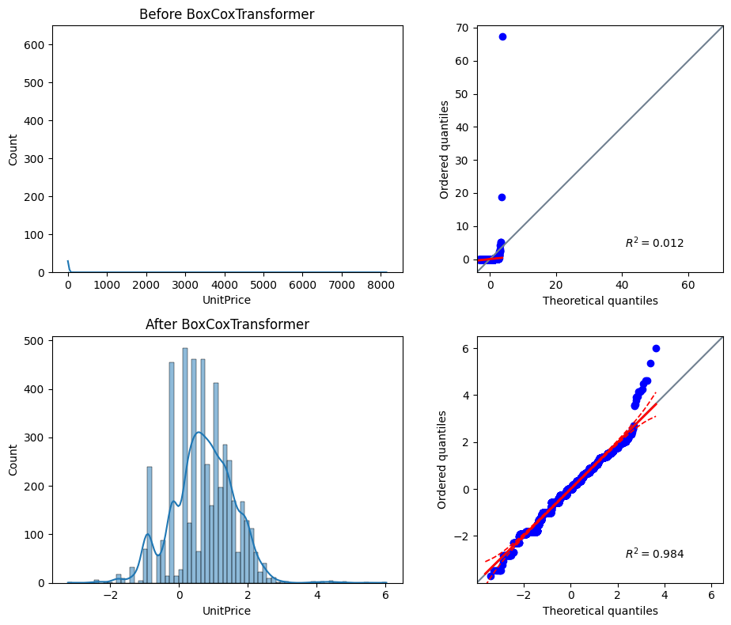

# Online Retail Transaction Analysis

## Project Overview
This project analyses transactional data from a UK-based online retailer 
covering the period 2010-2011. The goal is to uncover insights about 
customer behaviour, product popularity, sales trends, and pricing patterns 
to support data-driven business decisions.

## Target Audience
- E-commerce managers looking to understand customer behaviour
- Marketing teams seeking to optimise campaigns
- Product managers wanting to improve product strategy

## Dataset
- **Source:** [Online Retail Transactions Dataset](https://www.kaggle.com/datasets/abhishekrp1517/online-retail-transactions-dataset) (Kaggle)
- **Records:** 524,878 transactions after cleaning
- **Period:** December 2010 – December 2011
- **Columns:** InvoiceNo, StockCode, Description, Quantity, InvoiceDate, UnitPrice, CustomerID, Country

## Business Requirements
1. Which products are sold the most by quantity?
2. How have sales developed month by month over the years?
3. Is there a correlation between product price and quantity sold?
4. How is UnitPrice distributed and can it be normalised?

## Project Hypothesis
1. A small number of products will account for the majority of total sales (Pareto principle)
2. Sales will peak in November-December due to Christmas shopping
3. Products with a lower unit price will have a higher quantity sold
4. UnitPrice will be right-skewed and can be normalised with Yeo-Johnson transformation

## Project Structure
```
DA_project_1/
├── assets/          # Plot images for README
├── data/
│   ├── source/          # Raw dataset files
│   └── processed/       # Cleaned dataset
├── jupyter_notebooks/
│   ├── 01_load_and_clean_data.ipynb
│   ├── 02_analysis_and_visualizations.ipynb
│   └── 03_summary.ipynb
├── requirements.txt
└── README.md
```

## How to Run
1. Install dependencies: `pip install -r requirements.txt`
2. Run `01_load_and_clean_data.ipynb` to clean the data
3. Run `02_analysis_and_visualizations.ipynb` for analysis and visualisations
4. Run `03_summary.ipynb` for conclusions

## Hypothesis Validation
| Hypothesis | Result |
|------------|--------|
| A small number of products drive the majority of sales (Pareto) | Partially supported |
| Sales peak in November-December due to Christmas shopping | Supported |
| Lower-priced products sell in higher quantities | Supported |
| UnitPrice is right-skewed and normalisable | Confirmed — Yeo-Johnson R²=0.989 |

### BR1 — Top 10 Best-Selling Products


### BR2 — Sales Trends Over Time



### BR3 — Price vs Quantity Relationship



### BR4 — Price Distribution and Normalisation


## Technologies Used
- **Python 3.12**
- **Pandas** — data manipulation
- **Matplotlib & Seaborn** — data visualisation
- **Plotly** — interactive visualisations
- **Feature Engine** — Yeo-Johnson transformation
- **Scikit-learn** — pipeline
- **Pingouin** — statistical analysis
- **Jupyter Notebook** — development environment
- **GitHub** — version control

## Design Decisions
- Scatter plot was chosen over box plot for BR3 as it better shows 
  the relationship between two continuous variables
- Yeo-Johnson was chosen after testing multiple transformers 
  (Log, Reciprocal, Power, Box-Cox and Yeo-Johnson) — 
  Yeo-Johnson produced the best fit (R²=0.989) and is more 
  generalizable to datasets with zero or negative values

#### Transformer Comparison
All five transformers were tested on a sample of 5,000 UnitPrice rows. 
The results below show why Yeo-Johnson was selected:







- All visualisations were built using Plotly for interactivity

## Challenges
- GitHub Copilot occasionally suggested overly complex solutions 
  that needed to be simplified for the scope of this project
- Comparing multiple transformers required careful evaluation 
  to identify the best fit for the UnitPrice distribution

## Summary of Work

> **Note:** GitHub Copilot was asked to summarise the work performed across the 
>project notebooks. The summary below is based on Copilot's output, 
>reviewed and adapted to reflect the actual findings of this project.

### 01 - Load and Clean Data (load_and_clean_data.ipynb)

- Loaded raw transactions from `data/source/online_retail.csv` into a DataFrame.
- Inspected missing values and dropped rows with missing product `Description`.
- Removed exact duplicate rows.
- Filtered out invalid transactions: removed rows with `UnitPrice` <= 0 and `Quantity` <= 0 (returns/cancellations).
- Created a `TotalPrice` column (`UnitPrice * Quantity`).
- Converted `InvoiceDate` to datetime and extracted `Month` and `Year` for time-based analysis.
- Normalised identifier columns (`InvoiceNo`, `StockCode`, `CustomerID`) to string type and removed cancellation invoices where `InvoiceNo` starts with `'C'`.
- Saved cleaned output to `data/processed/online_retail_cleaned.csv` for downstream use.

Notes / considerations:
- Returns and cancellations were removed from the main cleaned dataset — a separate export or flag is recommended if you want to analyse refunds.
- Whitespace-only descriptions or non-standard encodings may not have been fully handled; consider trimming and normalising text.
- There is no automated cleaning report saved (only printed summaries) — adding a small `cleaning_report.csv` helps reproducibility.

### 02 - Analysis and Visualizations (analysis_and_visualizations.ipynb)

- Loaded the cleaned dataset `data/processed/online_retail_cleaned.csv`.
- Created visual answers to the business questions:
  - Top 10 best-selling products by quantity (bar chart).
  - Monthly revenue and number of orders (time series).
  - Explored the relationship between product price and quantity sold (scatter / interactive Plotly chart).
  - Analysed UnitPrice distribution and tested five transformers (Log, Reciprocal, Power, Box-Cox and Yeo-Johnson) — Yeo-Johnson selected as best fit (R²=0.989).
- Created interactive Plotly visualisations for all business requirements, with an improved scatter plot featuring colour scaling and hover tooltips.

Key findings observed in the analysis notebook:
- A small number of products account for a large share of quantity sold (Pareto-like behaviour among top sellers).
- Revenue shows a strong seasonal pattern with a peak in November 2011 and elevated sales toward the end of the year.
- The relationship between average product price and total quantity sold is not strongly linear; lower-priced items often sell more but there are many exceptions (use segmentation to investigate further).
- UnitPrice is heavily right-skewed (R²=0.012) — Yeo-Johnson transformation successfully normalised the distribution (R²=0.989), outperforming all other tested transformers.

## Project Maintenance and Cleanup

> **Note:** Claude (Anthropic) was asked to review the completed project and suggest maintenance improvements. The changes below were implemented based on Claude's recommendations.

### requirements.txt
Removed unused packages and their exclusive transitive dependencies to reduce the dependency footprint. The following top-level packages were not used in any project notebook and were removed:

| Package removed | Reason |
|-----------------|--------|
| `ydata-profiling` | Automated EDA tool — not used in any notebook |
| `streamlit` | Web app framework — not used |
| `xgboost` | ML algorithm — not used |
| `yellowbrick` | ML visualisation — not used |
| `wordcloud` | Word cloud plots — not used |
| `imbalanced-learn` | Imbalanced dataset ML — not used |
| `GitPython` | Git operations in Python — not used in notebooks |
| `openpyxl` | Excel file support — only CSV files are used |

Their exclusive transitive dependencies were also removed: `altair`, `pydeck`, `blinker`, `protobuf`, `htmlmin`, `ImageHash`, `phik`, `visions`, `multimethod`, `dacite`, `numba`, `llvmlite`, `networkx`, `narwhals`, `cachetools`, `PyWavelets`, `xarray`, `gitdb`, `smmap`, `et_xmlfile`.

### 02_analysis_and_visualizations.ipynb
Added `dtype={'InvoiceNo': str}` to the `pd.read_csv()` call when loading the cleaned dataset. This suppresses a `DtypeWarning` caused by `InvoiceNo` being saved as a string in the cleaning notebook but parsed as mixed types on reload.

### README.md
Removed the `output/` folder from the project structure, as no plots or reports are written to that directory in the project notebooks.

## Credits

### Dataset
- [Online Retail Transactions Dataset](https://www.kaggle.com/datasets/abhishekrp1517/online-retail-transactions-dataset) by Abhishek R P on Kaggle

### AI Assistance
- GitHub Copilot — used for code review, suggestions and summarisation
- The specific contributions of AI tools are documented in each notebook
- Claude (Anthropic) — used for guidance, problem-solving, and code review during development; also used post-completion for project maintenance (see summary notebook for details)

## Acknowledgements
- Code Institute LMS — course material and project template
- Marcel (mentor) — guidance throughout the project
